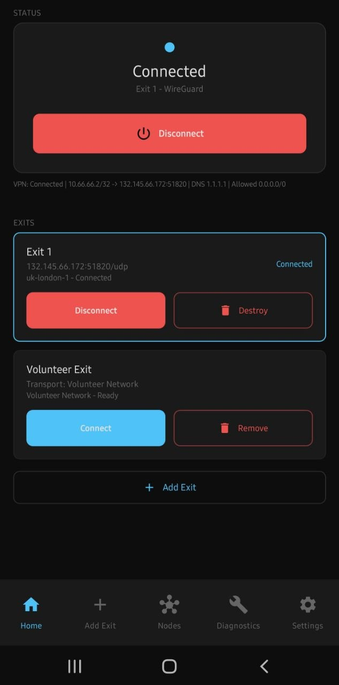
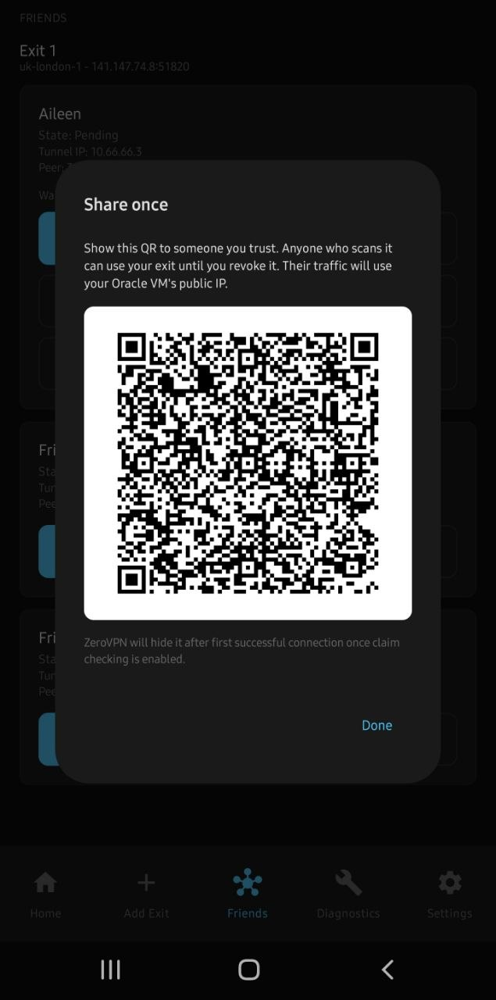

# ZeroVPN

[](LICENSE)
[](https://github.com/Undert0e-505/zero-vpn/releases)
[](https://github.com/Undert0e-505/zero-vpn)
[](https://www.oracle.com/cloud/free/)
[](https://www.wireguard.com/)

ZeroVPN is an open-source Android app for creating and managing a personal VPN server on Oracle Cloud from your phone. It provisions a WireGuard-based VPN on an Oracle Cloud Free Tier VM, connects your Android traffic through it, and lets you share trusted access with friends via QR invites.

It is designed for people who want a small, inspectable, self-hosted VPN setup without manually working through cloud-console steps every time.

- **Android only** — no iOS support planned
- **MIT licensed** — forkable, modifiable, self-hostable
- **Self-hosted backend** — your own Oracle Cloud VM, no central ZeroVPN server
- **Not a commercial VPN** — no accounts, no subscriptions, no hosted backend

## Screenshots



*Home — VPN connected through an Oracle Cloud WireGuard exit*



*Exit management — Oracle Cloud exit with disconnect and destroy controls*

## Features

- Create a personal WireGuard VPN server on Oracle Cloud Free Tier from your phone
- Connect Android traffic through your own cloud VM using Android `VpnService`
- Share VPN access with trusted friends via QR-based WireGuard invites (3 slots per exit)
- Import shared WireGuard exits by scanning a QR code
- Experimental Volunteer Exit mode using embedded Tor for web/TCP traffic (no cloud VM needed)
- Disconnect, destroy, and cleanup Oracle Cloud resources from the app
- Diagnostics screen showing connection state, exit IP, DNS status, and handshake info
- MIT licensed and forkable

## Why ZeroVPN?

Commercial VPN providers are convenient, but they require trusting a company with your traffic data. ZeroVPN gives you a personal VPN on infrastructure you control — an Oracle Cloud Free Tier VM that you own and can destroy at any time. No ZeroVPN accounts, no subscription service, no central backend.

**Note:** ZeroVPN is not an anonymity guarantee. It does not hide your identity by itself. The exit operator, cloud provider, destination services, apps, and device signals still matter. See the [threat model](docs/THREAT_MODEL.md) for details.

## Tech Stack

| Layer | Technology |
|-------|-----------|
| Android app | Kotlin, Jetpack Compose |
| VPN tunnel | WireGuard via Android `VpnService` |
| Cloud VM | Oracle Cloud Infrastructure (Free Tier) |
| Cloud SDK | OCI Java SDK |
| Volunteer Exit | Embedded Tor + HEV tun2socks |
| Sharing | QR-based WireGuard invite import |
| License | MIT |

## Project Status

**Experimental — v0.2.0 released.**

- Oracle Free Exit creation, Friends sharing, Shared Exit import, and Volunteer Exit are all hardware-tested.
- First-time Oracle VM creation takes ~5 minutes (VM provisioning, networking, SSH, WireGuard install). Reconnecting after setup is fast.
- The app is experimental and should not be treated as a polished or professionally audited security product.
- See the full [threat model](docs/THREAT_MODEL.md) before relying on ZeroVPN.
- Android is the only supported platform.

---

## What It Is

- An Android app for creating a personal Oracle Free Exit.
- A WireGuard-based VPN client using Android `VpnService`.
- A trusted Friends sharing workflow for QR-based WireGuard invites.
- An importer for shared WireGuard exits.
- An experimental Volunteer Exit mode for no-cloud, web-focused routing.

## What It Is Not

- Not an anonymity guarantee.
- Not a Tor Browser replacement.
- Not a commercial VPN service.
- Not a hosted ZeroVPN network.
- Not a way to bypass Oracle account, billing, capacity, or MFA requirements.

### What Works In v0.2.0

#### Oracle Free Exit

- Authenticates with Oracle Cloud from the Android app.
- Discovers and uses the OCI region for the account.
- Provisions an Oracle Cloud VM intended for Always Free usage.
- Configures OCI networking and security rules.
- Installs WireGuard on the VM.
- Creates the owner WireGuard profile.
- Creates three Friends invite WireGuard profiles.
- Connects Android traffic through the VM using Android `VpnService` and
  WireGuard.
- Supports destroy and cleanup flows.
- First creation typically takes several minutes while Oracle creates the VM,
  networking, SSH access, WireGuard, and the owner/friend invite keys.
- Reconnecting after setup is fast because the VM and WireGuard config already
  exist.

#### Friends / Share Exit

- Each owner Oracle exit gets three invite slots.
- The owner can name and share a slot by QR.
- The recipient scans the QR in app and imports it as a Shared Exit.
- The owner can check for the recipient's first WireGuard handshake.
- After first successful handshake, ZeroVPN burns the local QR/private share
  material.
- The owner can revoke/reset a slot, remove the old peer, and create a fresh
  unused invite for the same slot.

#### Shared Exit Import

- Scans a WireGuard QR in app.
- Adds the imported profile to Home as a Shared Exit.
- Connects through the shared WireGuard server.
- Supports rename and local removal.
- Cannot manage, destroy, or reset the owner's VM.

#### Volunteer Exit

- Works without an Oracle account or cloud VM.
- Uses an embedded Tor plus Android `VpnService` / HEV-style tun2socks path.
- Has produced non-local/non-UK public IPs in hardware testing.
- Is experimental, slower, web/TCP-focused, and may be blocked by some sites.
- Does not provide a fully hardened or audited anonymity system.
- UDP is not supported or guaranteed.

#### Diagnostics

- Shows connection state, selected exit details, exit IP, DNS status, and
  handshake information.
- Shows Friends/share metadata useful for v0.2.0 testing.
- Does not display private keys, raw WireGuard configs, QR payloads, PSKs, or
  SSH private keys.

## Important Limitations

- ZeroVPN is experimental software.
- A VPN changes the network exit path; it does not hide identity by itself.
- Oracle exits are cloud VMs in the user's Oracle account.
- The user is responsible for Oracle resources, invited users, and VM costs or
  limits.
- Friends sharing should only be used with people you trust.
- Volunteer Exit is experimental and is not a full audited anonymity system.
- UDP support is limited or unavailable in Volunteer Exit.
- Android is the only supported client platform at present.
- There is no commercial ZeroVPN service or hosted backend.

## Threat Model

Read the current threat model before relying on ZeroVPN:

https://github.com/Undert0e-505/zero-vpn/blob/main/docs/THREAT_MODEL.md

The short version: ZeroVPN gives the user control over the traffic exit path,
but the exit operator, cloud provider, destination services, apps, and device
signals still matter.

## Installation

Install the latest v0.2.0 APK from GitHub Releases.
Android will ask you to allow installation from the browser or file manager you
use to open the APK.

## Before Using Oracle Free Exit

You need:

- An Android device.
- An Oracle Cloud account.
- Oracle account email, password, and MFA working in a browser.
- Oracle Free Tier / Always Free eligibility.
- An internet connection.

ZeroVPN cannot create your Oracle account for you. It does not bypass Oracle
login, payment-card verification, region checks, capacity limits, or MFA.

Useful Oracle links:

- Oracle Cloud Free Tier signup: https://signup.oraclecloud.com/
- Oracle Cloud Free Tier overview: https://www.oracle.com/cloud/free/
- Oracle MFA documentation: https://docs.oracle.com/en-us/iaas/Content/Identity/Tasks/usingmfa.htm
- Oracle Cloud Console: https://cloud.oracle.com/

## Basic Usage

### Create Your Own Oracle Exit

1. Open ZeroVPN.
2. Choose **Add Exit**.
3. Choose **Create Oracle Free Exit**.
4. Sign in to Oracle when the browser opens.
5. Return to ZeroVPN.
6. Let ZeroVPN discover the region and provision the VM. First setup normally
   takes about 5 minutes.
7. Connect from Home.

Do not assume the app is stuck just because first provisioning takes several
minutes. The slow part is creating and configuring cloud infrastructure; normal
reconnects after that are quick.

### Share With A Trusted Friend

1. Create an Oracle Free Exit.
2. Open **Friends**.
3. Pick one of the three invite slots.
4. Name the slot and show the QR.
5. Have the recipient scan it using **Add Exit -> Scan QR Invite**.
6. After the recipient connects, use **Check claim**.
7. ZeroVPN burns the local QR/private share material after first handshake.
8. Use **Revoke and reset invite** when that person should lose access.

### Use A Shared Exit

1. Choose **Add Exit -> Scan QR Invite**.
2. Scan the WireGuard QR.
3. Save the Shared Exit.
4. Connect from Home.

### Use Volunteer Exit

1. Choose **Add Exit -> Volunteer Exit**.
2. Create the local Volunteer Exit profile.
3. Connect from Home.

Expect slower web/TCP-focused behavior and possible site blocks.

## Build From Source

Requirements:

- Windows-native PowerShell.
- Android Studio or Android SDK installed.
- JDK available to Gradle.
- `android/local.properties` with `sdk.dir=...` if Gradle cannot find your SDK.

Debug build:

```powershell
cd android
.\gradlew.bat assembleDebug
```

Volunteer diagnostics build:

```powershell
cd android
.\gradlew.bat assembleDebug -PenableVolunteerDebug=true
```

v0.2.0 HEV-native APKs should be produced on Linux/GitHub Actions:

```bash
cd android
./gradlew assembleDebug -PenableHevNative=true
```

The HEV-native submodule uses symlink/header behavior that may not work on
Windows checkouts. Use the `v0.2 candidate build` GitHub Actions workflow for
candidate APKs; it checks out submodules recursively, builds with HEV native
enabled, verifies the HEV `.so` libraries are packaged, and uploads the APK
artifact.

Release dry-run:

```powershell
.\scripts\build-apk.ps1 -Version 0.2 -DryRun -PreRelease -Clean
```

Real release builds require local signing configuration and GitHub CLI
authentication. Do not commit local signing files or release APKs.

## Release Signing

Public release APKs are signed.

Local signing configuration is intentionally ignored by git. Use
`android/signing.properties` or the supported signing environment variables.
Do not commit `signing.properties`, keystores, passwords, APKs, or AAB files.

## Attribution

ZeroVPN is a project by Undert0e-505, built with Codex as an implementation
partner. OpenAI does not own, host, operate, or endorse ZeroVPN.

## License

MIT. See `LICENSE`.
